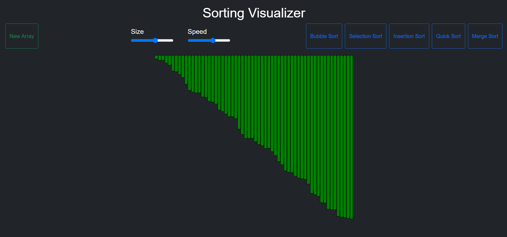

# Sorting Visualizer

### This is a simple visualization project made using javascript.

## Sorting Algorithms used

- [Bubble Sort](https://github.com/priyanshugupta9329/Sorting-Visualizer/blob/main/js_files/bubble.js)
- [Selection Sort](https://github.com/priyanshugupta9329/Sorting-Visualizer/blob/main/js_files/selection.js)
- [Insertion Sort](https://github.com/priyanshugupta9329/Sorting-Visualizer/blob/main/js_files/insertion.js)
- [Quick Sort](https://github.com/priyanshugupta9329/Sorting-Visualizer/blob/main/js_files/quick.js)
- [Merge Sort](https://github.com/priyanshugupta9329/Sorting-Visualizer/blob/main/js_files/merge.js)

### This is built using HTML, CSS, JavaScript

## Link

- [https://sortingvisualizer9329.herokuapp.com/](https://sortingvisualizer9329.herokuapp.com/)

## Screenshots

